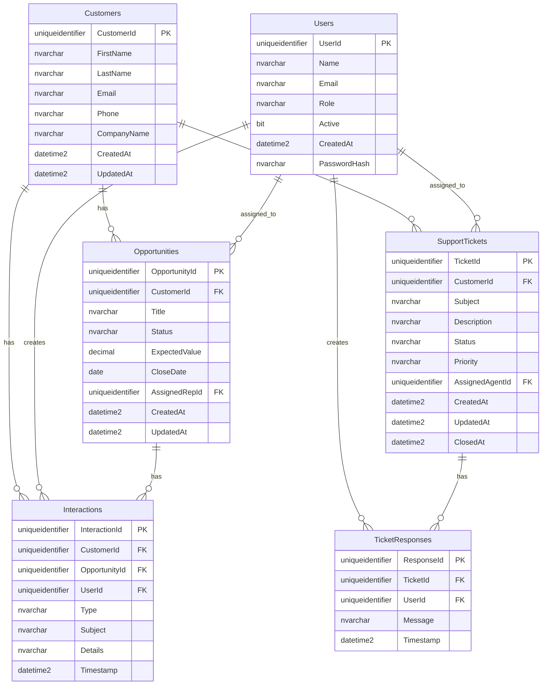

# Sample CRM App

A small **customer relationship management (CRM)** web application built with **ASP.NET Core 8** and **Blazor** (interactive server). It supports multiple users (team or solo use): sign-in with email and password, then manage **customers**, **opportunities**, **interactions**, and **support tickets** with threaded **ticket responses**. Administrators can create additional users from the **Users** screen.

---

## Features

- **Authentication** — Cookie-based sign-in backed by the `Users` table (passwords stored as PBKDF2 hashes via `PasswordHasher`).
- **Roles** — `Admin` and `Agent` (`AppRoles`). Admins see **Users** in the nav and can assign support tickets to agents on ticket detail; agents see a read-only note for assignment.
- **Dashboard** — High-level counts (customers, open opportunities, open tickets, recent interactions).
- **CRM areas** — Customers (CRUD + detail with related counts), Opportunities (CRUD, customer + optional assigned rep), Interactions (log and filter by customer), Support tickets (create, list, detail with status updates and responses).
- **Database** — Entity Framework Core with SQL Server; schema matches the CRM ERD (GUID keys, nullable `Interactions.OpportunityId`, etc.).

---

## Prerequisites

| Requirement                                                            | Notes                                                                                                                                                                     |
| ---------------------------------------------------------------------- | ------------------------------------------------------------------------------------------------------------------------------------------------------------------------- |
| **[.NET 8 SDK](https://dotnet.microsoft.com/download/dotnet/8.0)**     | Required to build and run the app. Verify with `dotnet --version` (8.x).                                                                                                  |
| **[Docker](https://docs.docker.com/get-docker/)** & **Docker Compose** | Used to run SQL Server 2022 locally. Optional if you already have SQL Server and a matching database.                                                                     |
| **SQL Server**                                                         | Default setup expects **localhost:1433**, database **SampleCRMDB**, login **sa** (see [appsettings.json](appsettings.json) and [docker-compose.yml](docker-compose.yml)). |

Optional:

- **[dotnet-ef](https://learn.microsoft.com/en-us/ef/core/cli/dotnet)** — For creating new migrations. This repo includes a **local tool manifest** under `.config/dotnet-tools.json`; use `dotnet tool restore` then `dotnet tool run dotnet-ef` (see below).

---

## Quick start

### 1. Start SQL Server (Docker)

From the repository root:

```bash
docker compose up -d
```

Wait until the `mssql` service is healthy. The `mssql-init` service creates the **SampleCRMDB** database if it does not exist.

**Default SQL credentials (development only):**

- **User:** `sa`
- **Password:** `SampleCRM_Sa1!`
- **Port:** `1433`
- **Database:** `SampleCRMDB`

Change these in production and update `ConnectionStrings:DefaultConnection` accordingly.

### 2. Run the web app

```bash
dotnet restore
dotnet run
```

Or open the project in Visual Studio / Rider / VS Code and run the **https** or **http** profile.

**Typical URLs** (see [Properties/launchSettings.json](Properties/launchSettings.json)):

- HTTPS: `https://localhost:7273`
- HTTP: `http://localhost:5179`

### 3. Sign in

On first run, the app applies EF Core **migrations** and seeds a default admin if no users exist:

| Field        | Value                   |
| ------------ | ----------------------- |
| **Email**    | `admin@samplecrm.local` |
| **Password** | `Admin123!`             |

Use **Admin → Users** (admin only) to create more accounts (`Admin` or `Agent`).

---

## Configuration

- **Connection string:** `ConnectionStrings:DefaultConnection` in [appsettings.json](appsettings.json) and [appsettings.Development.json](appsettings.Development.json).
- **Cookie name / session:** Configured in [Program.cs](Program.cs) (`SampleCRM.Auth`, sliding 8-hour expiration).
- **Authorization:** A fallback policy requires an authenticated user; [Login](Components/Pages/Account/Login.razor) and [Error](Components/Pages/Error.razor) allow anonymous access.

For secrets in real deployments, prefer **User Secrets**, **environment variables**, or a secret store—not committed JSON files.

---

## Database schema

The app uses **SQL Server** with database **SampleCRMDB**. Tables and columns are created by **EF Core migrations**; names and types below match the model in [Data/ApplicationDbContext.cs](Data/ApplicationDbContext.cs) and [Data/Entities/](Data/Entities/).

### Entity relationship overview



## Database and EF Core

- **Context:** `ApplicationDbContext` in [Data/ApplicationDbContext.cs](Data/ApplicationDbContext.cs).
- **Entities:** [Data/Entities/](Data/Entities/) (`Customer`, `User`, `Opportunity`, `Interaction`, `SupportTicket`, `TicketResponse`).
- **Migrations:** [Data/Migrations/](Data/Migrations/).
- **Startup:** [DbInitializer](Data/DbInitializer.cs) runs `MigrateAsync()` then seeds the admin user when the database is empty.

### Add a new migration (optional)

```bash
cd /path/to/SampleCRMApp
dotnet tool restore
dotnet tool run dotnet-ef migrations add YourMigrationName --output-dir Data/Migrations
```

Design-time factory: [Data/ApplicationDbContextFactory.cs](Data/ApplicationDbContextFactory.cs) (uses the same dev connection string as Docker defaults).

---

## Project structure (high level)

```
SampleCRMApp/
├── Components/           # Blazor UI (pages, layout, routes)
│   ├── Layout/
│   ├── Pages/          # Dashboard, Customers, Opportunities, Interactions, Tickets, Admin/Users, Account/Login
│   └── Routes.razor    # AuthorizeRouteView + redirects
├── Controllers/        # AccountController (login POST, logout GET)
├── Data/               # DbContext, entities, migrations, seeding
├── Services/           # Auth state provider, IUserContext
├── wwwroot/            # Static assets (CSS, Bootstrap)
├── Program.cs          # DI, pipeline, cookie auth, Blazor
├── docker-compose.yml  # SQL Server + DB init
└── appsettings*.json
```

---

## Security notes (important)

- Default SQL and app passwords are for **local development only**.
- Login uses **anti-forgery tokens**; MVC is registered with `AddControllersWithViews()` so `[ValidateAntiForgeryToken]` works on `AccountController`.
- **HTTPS** is recommended; the dev profile enables both HTTP and HTTPS.

---

## Troubleshooting

| Issue                      | What to check                                                                                 |
| -------------------------- | --------------------------------------------------------------------------------------------- |
| Cannot connect to SQL      | Docker is running, `docker compose ps`, port **1433** not used by another instance, firewall. |
| Login / antiforgery errors | Ensure you are on a current build; controllers use `AddControllersWithViews()`.               |
| Empty database / no tables | Run the app once so `DbInitializer` runs migrations; check Docker logs for SQL errors.        |
| Wrong URL                  | Match `launchSettings.json` or the URL printed in the console when you `dotnet run`.          |

---

## License

No license is specified in this repository; add one if you intend to distribute or open-source the project.
